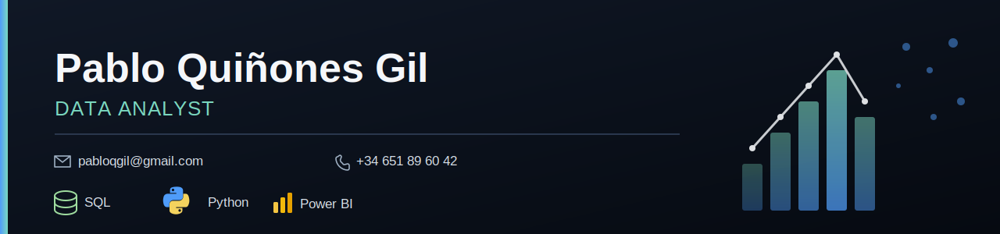

# 📊 Proyectos de Análisis de Datos

## 👋 Sobre mí

Soy Pablo Quiñones Gil, con formación académica en ADE y especialización en Máster de Data Analyst. Cuento con más de 2 años de experiencia en el sector retail, centrado en procesos de extracción, transformación y limpieza de datos (ETL), así como la creación de dashboards para el control de stock, KPIs logísticos y toma de decisiones.

**Stack:** Power BI · QlikView · Excel avanzado (Power Query, Power Pivot) · SQL · Python · Dynamics 365 · Navision

📫 [LinkedIn](https://www.linkedin.com/in/pabloquinonesgil/) · 📧 pabloqgil@gmail.com

Este repositorio recoge mis proyectos de análisis de datos a modo de portfolio.

---

## Retail Project — Análisis de comportamiento de clientes (2020–2021)

🔗 [Ver proyecto completo](https://github.com/pabloDev171/pabloDev171/tree/main/Retail%20Project)

ETL en Python (Pandas) sobre un dataset JSON de pedidos, con cálculo de métricas de recurrencia de clientes y cuadro de mando interactivo en Power BI, desglosado por año/mes de adquisición y por estado.

**Stack:** Python (Pandas) · Power BI

**Métricas clave obtenidas:** % Clientes Recurrentes (47,81 %) · Importe Medio del Primer Pedido (1.878,49 €) · Importe Medio de los Pedidos Recurrentes (12.268,57 €) · Tiempo Medio entre Recurrencias (31,77 días).

---
